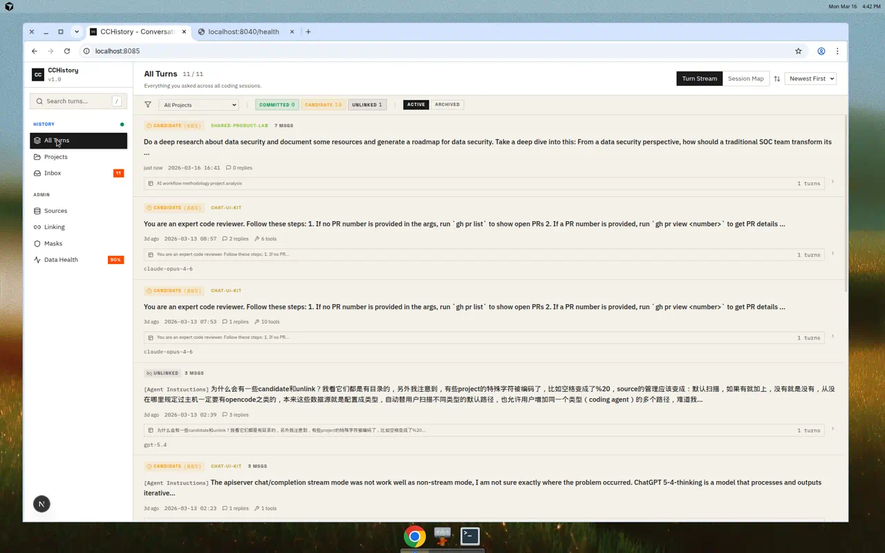
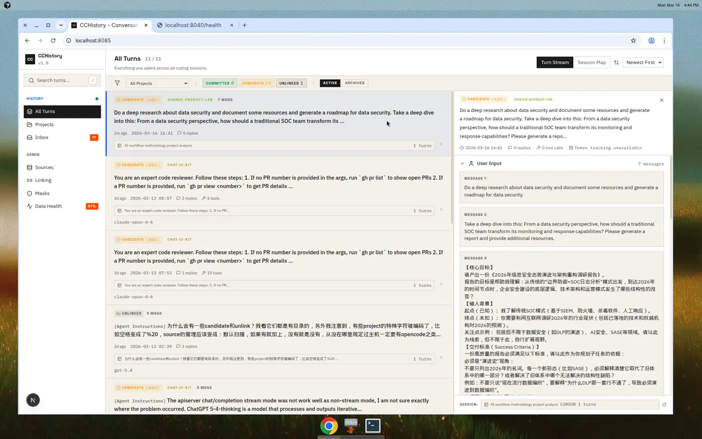
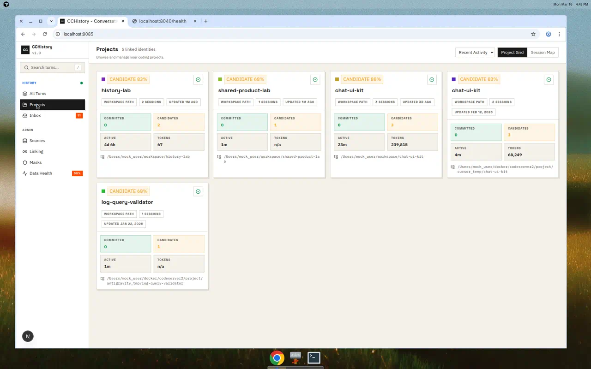
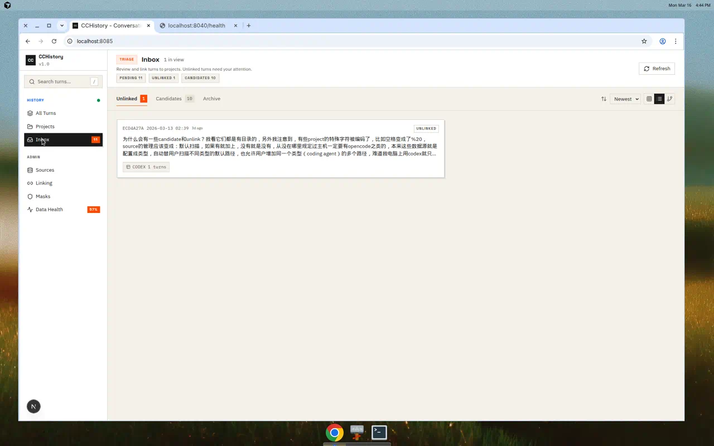
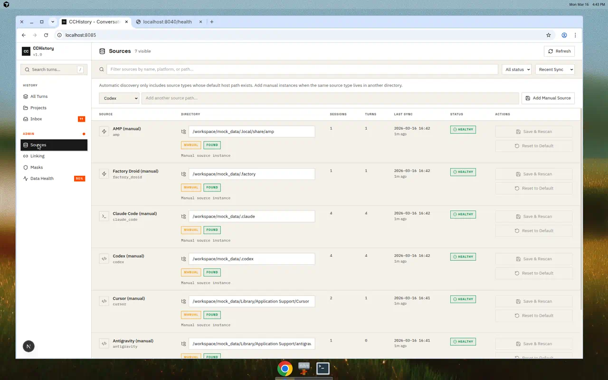
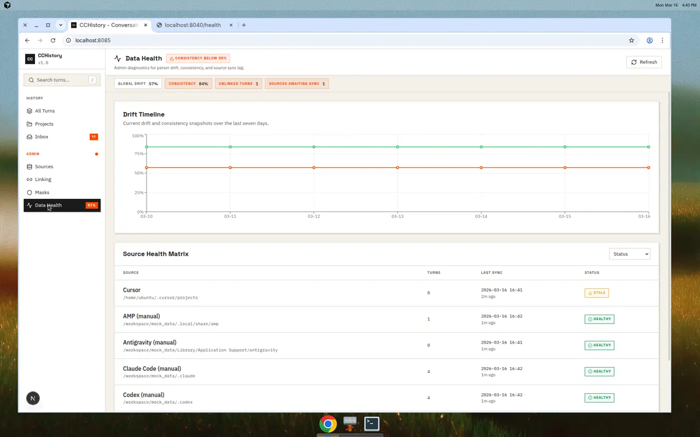

<p align="center">
  <strong>CCHistory</strong><br>
  <em>Historial que conserva evidencias para asistentes de programación con IA</em>
</p>

<p align="center">
  =22" />
  
  
  
  
</p>

<p align="center">
  Español | <a href="README_CN.md">简体中文</a>
</p>

---

CCHistory `0.3.0` es una capa de memoria local-first que conserva evidencias para el historial de asistentes de programación con IA. Recopila datos de sesión locales de **14 plataformas de asistentes de código con IA, incluyendo Claude Code, Cursor, Codex, AMP, Gemini CLI, Kimi Code, Accio Work, ZCode, y más** (ver [Plataformas compatibles](#supported-platforms)), y luego los organiza por identidad de proyecto para que puedas buscar, revisar y analizar lo que solicitaste a través de las herramientas.

El objeto de recuperación principal es el `UserTurn` con alcance de proyecto: una solicitud creada por el usuario,
vinculada a su proyecto, contexto de sesión, evidencia de origen y estado derivado del ciclo de vida.
Las superficies CLI, TUI, Web y API son proyecciones del mismo almacén canónico en lugar de interpretaciones separadas.

<p align="center">
  
</p>

## Inicio rápido

| Objetivo | Uso |
|------|-----|
| Sincronizar el historial local de herramientas de IA e inspeccionar el estado | [`cchistory sync`](docs/guide/cli.md#sync), [`cchistory health`](docs/guide/cli.md#health) |
| Encontrar una solicitud anterior e inspeccionar la sesión circundante | [`cchistory search`](docs/guide/cli.md#search), [`cchistory show`](docs/guide/cli.md#show), [`cchistory tree`](docs/guide/cli.md#tree) |
| Proporcionar contexto de proyecto a un agente de IA antes de que continúe trabajando | [`cchistory context project <ref>`](docs/guide/cli.md#context) |
| Navegar por el historial de forma interactiva | [Guía de TUI](docs/guide/tui.md) o [Guía de Web](docs/guide/web.md) |
| Inspeccionar el historial local nativo sin crear o leer un almacén de CCHistory | [Guía de CC History Lite](docs/guide/lite.md), `cchistory-lite`, `cchistory-lite-tui` |
| Hacer copia de seguridad, restaurar o mover un almacén | [Guía de CLI copia de seguridad/importar/restaurar](docs/guide/cli.md#backup-and-restore) |
| Comprender el estado de soporte y la cobertura del analizador | [Mapa de documentación](docs/README.md), [superficie de ejecución](docs/design/CURRENT_RUNTIME_SURFACE.md), [notas de origen](docs/sources/README.md) |

## Características principales

- **Ingesta multiplataforma** — Recopila conversaciones de adaptadores de origen locales registrados mediante análisis de archivos locales y sondas en vivo específicas de la aplicación cuando sea necesario
- **Conservación de evidencias** — Se conserva y puede rastrearse la evidencia sin procesar; cada `UserTurn` se deriva, nunca se crea directamente
- **Vinculación basada en proyectos** — Los turnos se vinculan a proyectos mediante huellas de repositorio, rutas de espacio de trabajo y anulaciones manuales
- **Contexto de proyecto listo para IA** — `cchistory context project <ref>` proporciona a un agente solicitudes recientes, hilos de sesión y comandos de inspección siguientes a través de sesiones
- **Búsqueda de texto completo** — Busca en todo el texto canónico de los turnos con filtros de proyecto y origen
- **Cuatro superficies alineadas** — TUI y Web son superficies de lectura para usuarios finales; CLI y API son superficies de administración, automatización e integración
- **Perfil Lite sin almacén** — Reutiliza los mismos adaptadores, derivación de `UserTurn`/contexto, vinculación de proyectos, búsqueda y estadísticas en una CLI/TUI efímera de máquina única con exportación unidireccional
- **Análisis de uso de tokens** — Rastrea tokens entre modelos, proyectos, orígenes y períodos de tiempo
- **Exportar / Importar / Fusionar** — Paquetes portátiles para copia de seguridad, migración y fusión multihost
- **Monitoreo de salud de datos** — Métricas de deriva y consistencia con matriz de salud a nivel de origen

## Alcance de la versión

`0.3.0` es el marcador de versión actual del paquete, API e interfaz web del repositorio. La
terminología `self-host v1` en los documentos de diseño describe el alcance de implementación
compatible: una instalación local-first para un solo usuario en localhost o LAN de confianza, respaldada
por SQLite. No es una versión de paquete.

El nivel de soporte para cada adaptador de origen se define en
[`packages/source-adapters/src/platforms/registry.ts`](packages/source-adapters/src/platforms/registry.ts)
y se verifica mediante `pnpm run verify:support-status`.

## Plataformas compatibles

| Plataforma | Nivel Self-host v1 | Ubicación del origen |
|----------|-------------------|-----------------|
| Codex | **Stable** | `~/.codex/sessions/` |
| Claude Code | **Stable** | `~/.claude/projects/` |
| Cursor | **Stable** | Datos de usuario de la plataforma + historial de proyecto |
| AMP | **Stable** | `~/.local/share/amp/threads/` |
| Factory Droid | **Stable** | `~/.factory/sessions/` |
| Antigravity | **Stable** | Datos de usuario de la plataforma `User/` + `~/.gemini/antigravity/{conversations,brain}` |
| OpenClaw | **Stable** | `~/.openclaw/agents/` |
| OpenCode | **Stable** | `~/.local/share/opencode/{project,storage}` |
| Gemini CLI | **Stable** | `~/.gemini/` |
| LobeChat | Experimental | `~/.config/lobehub-storage/` |
| CodeBuddy | **Stable** | `~/.codebuddy/` |
| Accio Work | Experimental | `~/.accio/accounts/` |
| ZCode | Experimental | `~/.zcode/` |
| Kimi Code | Experimental | `~/.kimi-code/` |

> `Stable` significa validado en entornos reales para el nivel de soporte self-host v1. `Experimental` significa que el adaptador está registrado en el código pero aún no está validado lo suficiente para afirmar compatibilidad con self-host v1.
> Para `lobechat`, la ruta `~/.config/lobehub-storage/` listada sigue siendo el candidato raíz actual del fragmento experimental, no una ubicación canónica verificada con muestras reales; esa revisión permanece bloqueada bajo `R17`.
> Para `accio`, el adaptador está registrado como un origen de sesión de tiempo de ejecución local experimental mientras se valida aún su límite de soporte en entornos reales.
> Para `zcode`, el adaptador lee el almacén SQLite local de CLI en `~/.zcode/cli/db/db.sqlite`; permanece experimental hasta que la cobertura de fixtures saneados y validación en entornos reales se ponga al día.
> Para `kimi`, el adaptador lee `sessions/**/agents/main/wire.jsonl` del agente principal; `state.json`, `session_index.jsonl`, `workspaces.json`, `user-history/*.jsonl` y los cables de subagentes se conservan como evidencias complementarias. Permanece experimental mientras se validan muestras más amplias del formato.
> Ejecuta `pnpm run verify:support-status` para verificar estas afirmaciones de documentación frente al registro de adaptadores.

> Nota sobre Antigravity: CCHistory utiliza dos rutas complementarias para Antigravity. La API de trayectoria del servidor de lenguaje local de la aplicación de escritorio en ejecución proporciona el contenido real de la conversación (entradas de usuario, respuestas del asistente, llamadas a herramientas). Los archivos fuera de línea (`workspaceStorage`, `History`, `brain`) siempre se escanean en busca de rutas de proyecto y señales de espacio de trabajo. Si la aplicación de escritorio no se está ejecutando, solo se ejecuta la ruta fuera de línea, lo que significa que no se recuperará ningún contenido de conversación sin procesar; solo se obtendrán metadatos de proyecto y artefactos de evidencia.

## Arquitectura

```
┌──────────────────────────────────────────────────────────────────────┐
│                         Archivos de origen locales                    │
│  ~/.codex  ~/.claude  ~/.cursor  ~/.factory  ~/.local/share/amp ...  │
└──────────────┬───────────────────────────────────────────────────────┘
               │
               ▼
┌──────────────────────────────────────────────────────────────────────┐
│                 Adaptadores de origen (packages/source-adapters)      │
│  Analizadores específicos: capturar → extraer → analizar → atomizar   │
│  Objetos → Registros → Fragmentos → Átomos → Candidatos             │
└──────────────┬───────────────────────────────────────────────────────┘
               │
               ▼
┌──────────────────────────────────────────────────────────────────────┐
│                     Almacenamiento (packages/storage)                 │
│  SQLite vía node:sqlite integrado en Node.js (DatabaseSync)           │
│  Ingesta, vinculación, proyección, índice de búsqueda, seguimiento    │
└──────────┬──────────────────────┬───────────────────┬────────────────┘
           │                      │                   │
           ▼                      ▼                   ▼
                         Superficies de usuario final
           ┌───────────────────┐  ┌─────────────────────┐
           │  TUI (apps/tui)   │  │   Web (apps/web)    │
           │  Navegador de     │  │   Next.js 16        │
           │  terminal         │  │   React 19 en :8085 │
           │  Explorar, buscar,│  │   SWR, Tailwind,    │
           │  analizar conv.   │  │   Recharts          │
           └───────────────────┘  └─────────────────────┘
                    Superficies de admin / agente IA
┌──────────────────┐  ┌───────────────────┐
│  CLI (apps/cli)  │  │  API (apps/api)   │
│  Sync, health,   │  │  Fastify REST     │
│  export/import,  │  │  server en :8040  │
│  backup, GC,     │  │  CORS, auth,      │
│  agent ops       │  │  probe, replay    │
└──────────────────┘  └───────────────────┘
```

### Roles de las superficies

| Superficie | Objetivo | Propósito |
|---------|--------|---------|
| **TUI** | Usuario final (desarrollador) | Explorar historial de conversaciones como un gestor de archivos: proyectos, sesiones, conversaciones completas, búsqueda, estadísticas |
| **Web** | Usuario final (desarrollador) | Igual que TUI pero más rico: gráficos, filtros, triaje de bandeja, enfoque en ratón |
| **CLI** | Administrador / Agente IA | Gestión de datos: sincronización, exportar/importar, copia de seguridad, verificación de salud, GC, operaciones de agente remoto, salida `--json` scripteable |
| **API** | Acceso programático | Endpoints REST que alimentan la interfaz web e integraciones externas |

> **Comandos canónicos vs alias:** `export` / `import` son los primitivos canónicos de copia de seguridad. `backup`, `restore-check` y `merge` son alias orientados a operadores: `backup --write` produce el mismo paquete que `export`, `restore-check` ejecuta `stats` + `ls sources`, y `merge` encadena `export` luego `import` entre dos almacenes.

CC History Lite bifurca después del adaptador compartido y la canalización de derivación canónica.
Full persiste evidencias y proyecciones en SQLite; Lite conserva solo la instantánea final en memoria y nunca lee el almacén de Full. El gráfico de producción de Lite es `source-adapters -> canonical -> live-runtime -> lite-cli/lite-tui`.

## Inicio rápido

### Requisitos previos

- **Node.js >= 22** (legible por máquina mediante el campo raíz `engines.node`; usa `node:sqlite` integrado)
- **pnpm 10.x** (fijado vía `packageManager`, con rango compatible declarado en `engines.pnpm`)

### Instalación y compilación

Esta es la ruta de instalación canónica para máquinas limpias del repositorio. Instala
ambos archivos de bloqueo y realiza la compilación local predeterminada del perfil Full.

```bash
# Clonar e instalar
git clone https://github.com/aaaAlexanderaaa/cchistory.git
cd cchistory
pnpm install

# Instalar dependencias de la app web (archivo de bloqueo separado)
cd apps/web && pnpm install && cd ../..

# Perfil local Full predeterminado
pnpm run build

# Perfiles opcionales independientes
pnpm run build:lite
pnpm run build:managed
pnpm run build:agent-extension
```

La compilación de producción de `apps/web` se valida por separado de esta ruta de instalación.
Cuando la necesites, ejecuta:

```bash
NODE_OPTIONS=--max-old-space-size=1536 pnpm --filter @cchistory/web build
```

Para verificar el contrato de instalación en máquina limpia en una copia temporal sin
tocar tu árbol de trabajo, ejecuta:

```bash
pnpm run verify:clean-install
```

Para la superficie de verificación actual más amplia, estos comandos del repositorio son
los atajos principales:

| Necesidad | Comando |
|------|---------|
| Verificación de soporte/deriva de ejecución | `pnpm run verify:support-status` y `pnpm run verify:runtime-inventory` |
| Puerta de calidad de lectura CLI/TUI | `pnpm run verify:cli-tui-read-side` |
| Instalación limpia / distribución de artefactos | `pnpm run verify:clean-install` y `pnpm run verify:cli-artifact` |
| Compilación de producción Web | `pnpm run verify:web-build-offline` |

Consulta [`docs/design/CURRENT_RUNTIME_SURFACE.md`](docs/design/CURRENT_RUNTIME_SURFACE.md)
para el inventario completo de verificadores y lo que demuestra cada comando. Para
trabajo de desarrollo, mantén estas superficies de validación distintas:

- Los flujos de ingesta críticos de ejecución pasan por `packages/source-adapters` y
  `runSourceProbe`, y luego llegan al almacenamiento mediante `sync` o
  `replaceSourcePayload`.
- Los fixtures de proyección construidos con `replaceSourcePayload` son útiles para afirmaciones
  enfocadas de almacenamiento, CLI, TUI y API, pero no prueban la verdad del analizador.
- `mock_data/` contiene layouts de forma de origen anonimizados para adaptadores estables;
  verificadores generados como `scripts/verify-scale-recall.mjs` cubren almacenes temporales
  de alto volumen sin expandir la ruta predeterminada de pruebas de paquete.
- Las revisiones de Web/API gestionado y servicio de agente remoto permanecen como fragmentos
  manuales iniciados por el usuario; las verificaciones automatizadas locales no deben iniciar servicios de desarrollo persistentes.

Estos verificadores locales y ayudantes de revisión **no** significan que cada brecha de revisión manual
ya esté cerrada: los diarios web/API de tiempo de ejecución gestionado iniciados por el usuario seguidos bajo
`R31` y los diarios de agente remoto respaldados por servidor seguidos bajo `R35` siguen siendo
trabajo de revisión manual bloqueado hasta que un usuario proporcione los servicios en ejecución requeridos.

### Usar CC History Lite (sin almacén CCHistory)

Compila los puntos de entrada independientes de Lite:

```bash
pnpm --filter @cchistory/lite-cli build
pnpm --filter @cchistory/lite-tui build
```

Inspecciona raíces de origen nativas descubiertas automáticamente:

```bash
pnpm lite sources
pnpm lite ls projects
pnpm lite search "parser regression"
pnpm lite:tui
```

Anula y opcionalmente selecciona un adaptador registrado:

```bash
pnpm lite search "migration" \
  --source-root codex=/mnt/history/.codex/sessions \
  --source codex
```

Lite proporciona `sources`, `ls`, `tree`, `search`, `show`, `stats` y
`export` unidireccional en JSONL/JSON/Markdown. No tiene import, sync, backup, restore, merge,
GC, API, `--store` ni superficie `--db`. Su marcador de exportación es
`cchistory-lite-export/v1` y no es una copia de seguridad Full. Consulta la
[guía de Lite](docs/guide/lite.md) y ejecuta `pnpm run verify:lite` para la puerta
enfocada de paridad/aislamiento.

Para una máquina receptora sin el espacio de trabajo, ejecuta `pnpm run lite:artifact`.
El archivo resultante contiene tanto los binarios de Lite como cada dependencia de tiempo de ejecución privada; `pnpm run verify:lite-artifact` demuestra que el cierre extraído funciona
fuera del monorepo.

### Usar el artefacto CLI independiente

El repositorio también admite ahora un canal de artefacto solo CLI para casos donde la
máquina receptora no debería necesitar un checkout completo del código fuente.

Genera el artefacto desde un clon del repositorio:

```bash
pnpm run cli:artifact
```

Esto escribe un directorio extraído versionado más un artefacto `.tgz` bajo
`dist/cli-artifacts/`.

En otra máquina, descomprime el archivo tarball generado y ejecuta:

```bash
# Shells POSIX
./bin/cchistory --help

# Windows CMD
bin\cchistory.cmd --help
```

Actualiza reemplazando el directorio de artefacto extraído con una versión de artefacto generado más nueva. Para verificar el canal de artefacto localmente, ejecuta:

```bash
pnpm run verify:cli-artifact
```

Si deseas un pase de confianza de lectura completa local de un nivel superior que también cubra la ruta `--full` de TUI compilada, ejecuta:

```bash
pnpm run verify:local-full-read-bundle
```

Este alias agrupado ejecuta el verificador de artefacto instalado y el verificador esceptico de TUI compilada `--full` en secuencia.

Esto verifica la instalación inicial más actualización estilo reemplazo descomprimiendo dos
artefactos versionados, verificando el comando instalado `cchistory templates`, y
ejecutando flujos de trabajo de ruta instalada escepticos a través de restauración/conflicto,
navegación/búsqueda, administración de ámbito de almacén y recuperación estructurada: `sync -> backup
preview/write -> import -> restore-check -> search/show -> conflict
dry-run/replace`, más `health --store-only`, `ls sources`, `stats`, `query
session --id`, y `query turn --id`.

### Instalar el CLI globalmente

```bash
# Compilar y vincular el comando cchistory globalmente
pnpm run cli:link

# Ahora puedes usar `cchistory` desde cualquier lugar
cchistory sync
cchistory ls projects
cchistory context project <project-ref>
cchistory search "refactor"
cchistory stats
```

O ejecutar sin instalación global:

```bash
# Vía script pnpm
pnpm cli -- sync
pnpm cli -- ls projects

# O directamente vía node
node apps/cli/dist/index.js sync
```

### Iniciar la TUI

```bash
# Compilar el punto de entrada de la TUI
pnpm --filter @cchistory/tui build

# Mostrar ayuda o iniciar la TUI local
node apps/tui/dist/index.js --help
node apps/tui/dist/index.js
```

La TUI es un punto de entrada de lectura local y no requiere el servicio API gestionado. En una terminal no interactiva imprime una instantánea en lugar de abrir la interfaz Ink completa.

### Iniciar la interfaz web y la API

```bash
# Iniciar ambos servicios (API en :8040, Web en :8085)
pnpm services:start

# Abrir el panel
open http://localhost:8085
```

### Primera sincronización

```bash
# Sincronizar todos los orígenes locales detectados automáticamente
cchistory sync

# Verificar lo que se encontró
cchistory ls sources
cchistory ls projects
cchistory stats
```

> Para sincronizar Antigravity con cobertura completa de turnos, inicia la aplicación de escritorio de Antigravity en la misma máquina antes de ejecutar `cchistory sync`.

## Capturas de pantalla

<table>
<tr>
<td width="50%">
<strong>Todos los turnos — Flujo de turnos</strong><br>

Explora cada turno en todas las sesiones de programación con filtros para proyecto, estado de vínculo y eje de valor.
</td>
<td width="50%">
<strong>Panel de detalles del turno</strong><br>

Entrada completa del usuario, respuestas del asistente, llamadas a herramientas, uso de tokens y linaje de la canalización.
</td>
</tr>
<tr>
<td width="50%">
<strong>Proyectos</strong><br>

Tarjetas de proyecto con contadores de confirmados/candidatos, uso de tokens, sesiones y rutas de espacio de trabajo.
</td>
<td width="50%">
<strong>Bandeja de entrada</strong><br>

Clasifica turnos no vinculados y candidatos. Víncula a proyectos, crea nuevos o descarta.
</td>
</tr>
<tr>
<td width="50%">
<strong>Administración de orígenes</strong><br>

Configura orígenes, vea el estado de sincronización, añade orígenes manuales y sobrescribe directorios.
</td>
<td width="50%">
<strong>Salud de datos</strong><br>

Línea de tiempo de deriva, métricas de consistencia y diagnósticos de salud por origen.
</td>
</tr>
</table>

## Documentación

Comienza con **[Mapa de documentación](docs/README.md)** para el árbol de docs organizado.

Rutas de lectura principales:

- **Operar localmente** — [CLI](docs/guide/cli.md), [TUI](docs/guide/tui.md), [Web](docs/guide/web.md), [API](docs/guide/api.md)
- **Comprender la arquitectura** — [Congelamiento de diseño de alto nivel](HIGH_LEVEL_DESIGN_FREEZE.md), [Superficie de ejecución actual](docs/design/CURRENT_RUNTIME_SURFACE.md)
- **Validar una versión o afirmación de soporte** — [Puerta de versión Self-Host V1](docs/design/SELF_HOST_V1_RELEASE_GATE.md), [Estrategia de validación](docs/design/V1_VALIDATION_STRATEGY.md)
- **Inspeccionar datos de origen** — [Notas de origen](docs/sources/README.md), [Guía de inspección](docs/guide/inspection.md)
- **Informar problemas** — [Guía de informes de errores](docs/guide/bug-reporting.md), [Plantilla de informe de error](docs/templates/bug-report.md)
- **Seguimiento del trabajo futuro** — [Hoja de ruta](docs/ROADMAP.md)

## Estructura del proyecto

```
cchistory/
├── apps/
│   ├── api/                    # Servidor API REST Fastify (:8040)
│   ├── cli/                    # Herramienta de línea de comandos (cchistory)
│   ├── lite-cli/               # Lector de línea de comandos Lite sin almacén
│   ├── lite-tui/               # Navegador de terminal Lite sin almacén
│   ├── tui/                    # Navegador TUI local basado en Ink
│   └── web/                    # Frontend web Next.js 16 (:8085)
├── packages/
│   ├── canonical/              # Semántica de lectura canónica neutral al almacenamiento
│   ├── domain/                 # Contratos y tipos de dominio principal
│   ├── live-runtime/           # Materializador Lite efímero
│   ├── source-adapters/        # Analizadores específicos de plataforma
│   ├── storage/                # Persistencia y vinculación SQLite
│   ├── api-client/             # Contratos DTO API compartidos
│   └── presentation/           # Mapeo DTO → tipos UI
├── scripts/                    # Ayudantes de servicio de desarrollo, verificación e inspección
├── mock_data/                  # Corpus de fixtures saneados
├── skills/                     # Definiciones de habilidades de agente IA y contratos compartidos
├── docs/
│   ├── README.md               # Mapa de documentación y reglas de mantenimiento
│   ├── guide/                  # Guías orientadas al usuario (CLI, API, Web, TUI, inspección, informes de errores)
│   ├── sources/                # Notas técnicas para layouts de origen validados
│   ├── templates/              # Informes/plantillas reutilizables para operadores y mantenedores
│   ├── design/                 # Documentos de diseño interno
│   └── screenshots/            # Capturas de pantalla de la interfaz web
└── LICENSE                     # Licencia MIT
```

## Desarrollo

```bash
# Compilar el perfil local Full predeterminado
pnpm run build

# Compilar perfiles opcionales, o todos explícitamente
pnpm run build:lite
pnpm run build:managed
pnpm run build:agent-extension
pnpm run build:aggregate

# Ejecutar puertas de perfil independientes
pnpm run test:full
pnpm run test:lite
pnpm run test:managed
pnpm run test:agent-extension
pnpm run test:aggregate

# Lint
cd apps/web && pnpm lint

# Servicios de desarrollo
pnpm services:start       # Iniciar API + Web
pnpm services:stop        # Detener todo
pnpm services:status      # Verificar estado
```

## Licencia

[MIT](LICENSE)
