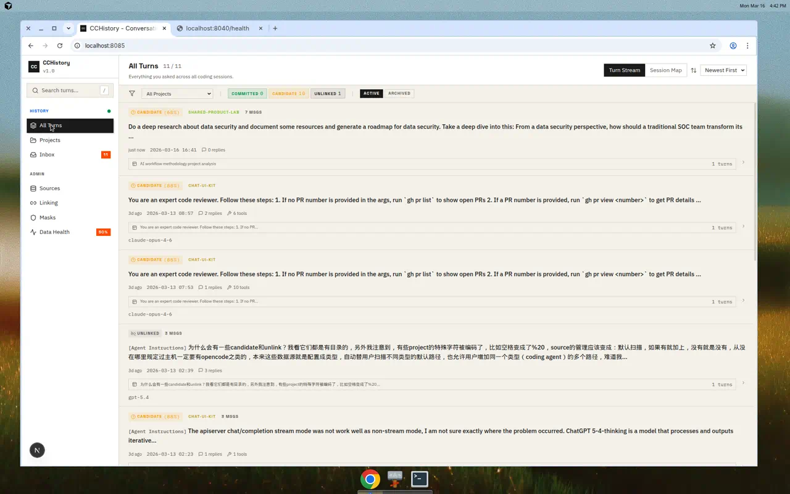
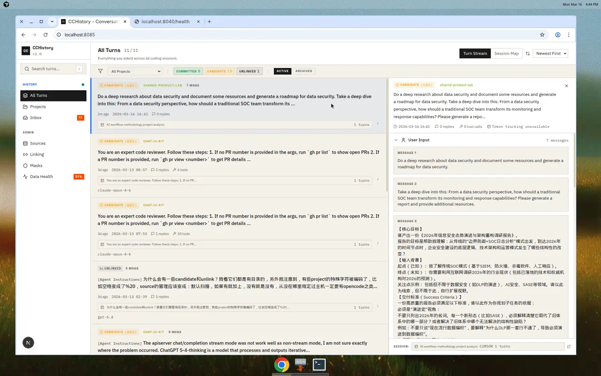
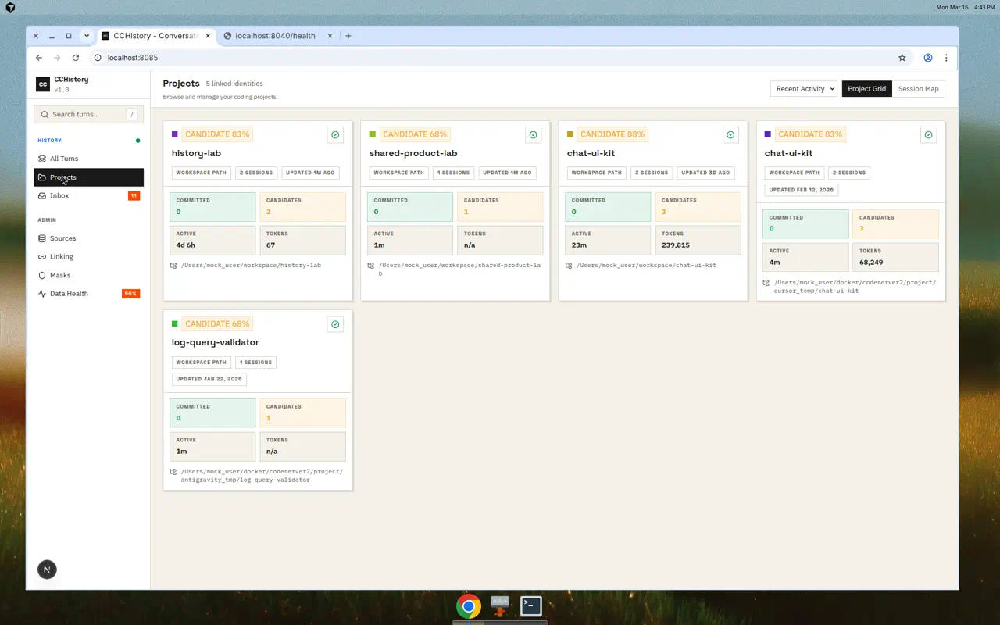
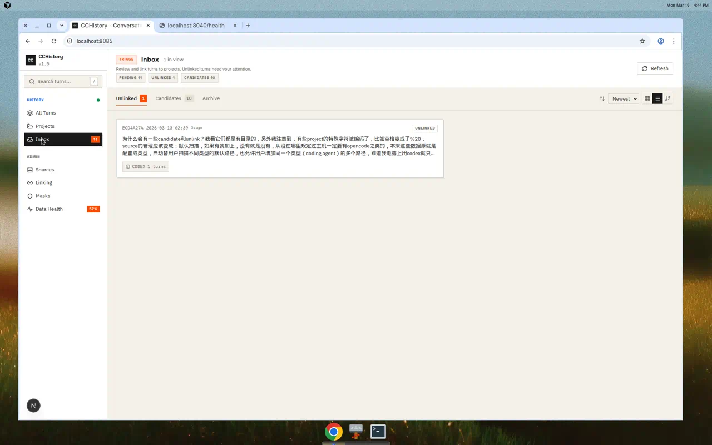
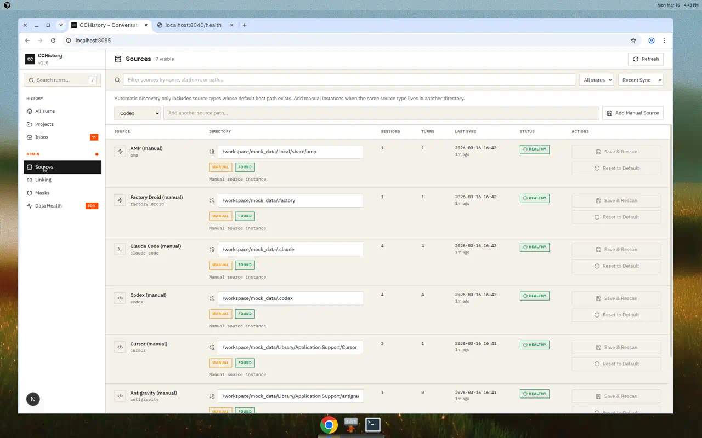
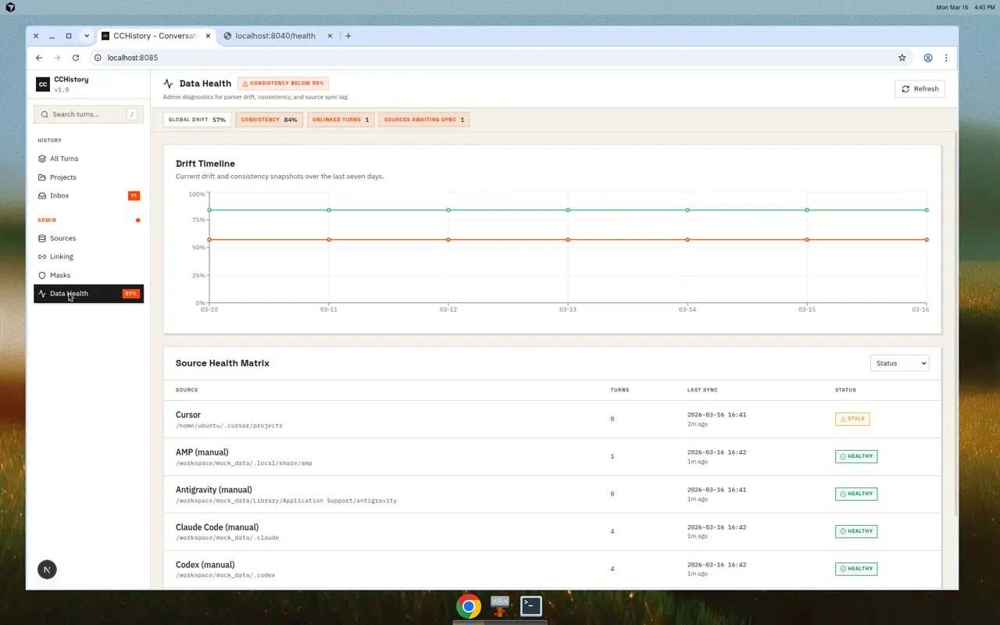

<p align="center">
  <strong>CCHistory</strong><br>
  <em>AI 编程助手的证据保全历史记录工具</em>
</p>

<p align="center">
  =22" />
  
  
  
</p>

<p align="center">
  <a href="README.md">English</a> | 简体中文
</p>

---

CCHistory 能够采集、解析并投射你与 AI 编程助手之间的所有对话，汇聚为统一的、证据保全的数据模型。它从 **Codex、Claude Code、Cursor、AMP、Factory Droid、Antigravity** 等平台的本地会话数据中收集信息，然后按照项目身份进行组织，让你能够跨工具搜索、回顾和分析所有对话内容。

<p align="center">
  
</p>

## 核心特性

- **多平台采集** — 通过本地文件解析以及必要时的本地应用实时探测，从多个 AI 编程助手平台收集对话数据
- **证据保全** — 原始证据被完整保留并可追溯；每个 `UserTurn` 都从源数据派生，绝不直接手动创建
- **基于项目的关联** — 通过仓库指纹、工作空间路径和手动覆盖将对话轮次关联到项目
- **全文搜索** — 在所有规范化对话文本中搜索，支持按项目和数据源过滤
- **Token 用量分析** — 跨模型、项目、数据源和时间维度追踪 Token 用量
- **导出 / 导入 / 合并** — 可移植的数据包，用于备份、迁移和多主机合并
- **数据健康监控** — 漂移和一致性指标，配有数据源级别的健康矩阵

## 支持平台

| 平台 | Self-host v1 分级 | 数据源位置 |
|------|-------------------|-----------|
| Codex | **Stable** | `~/.codex/sessions/` |
| Claude Code | **Stable** | `~/.claude/projects/` |
| Cursor | **Stable** | 平台用户数据 + 项目历史 |
| AMP | **Stable** | `~/.local/share/amp/threads/` |
| Factory Droid | **Stable** | `~/.factory/sessions/` |
| Antigravity | **Stable** | 平台用户数据 `User/` + `~/.gemini/antigravity/{conversations,brain}` |
| OpenClaw | **Stable** | `~/.openclaw/agents/` |
| OpenCode | **Stable** | `~/.local/share/opencode/{project,storage}` |
| Gemini CLI | **Stable** | `~/.gemini/` |
| LobeChat | Experimental | `~/.config/lobehub-storage/` |
| CodeBuddy | **Stable** | `~/.codebuddy/` |

> `Stable` 表示已经达到 self-host v1 的真实世界验证门槛。`Experimental` 表示 adapter 已经注册到代码里，但还没有足够的真实样本验证，不能作为 self-host v1 的正式支持承诺。
> 对 `lobechat` 来说，表里列出的 `~/.config/lobehub-storage/` 仍只是当前 experimental slice 使用的 root candidate，不应视为已经由真实样本验证过的 canonical location；这项评审仍阻塞在 `R17`。
> 可运行 `pnpm run verify:support-status`，把这些文档声明与 adapter registry 做一致性校验。

> Antigravity 说明：CCHistory 对 Antigravity 采用两条互补的采集链路。运行中的桌面应用通过本地 language server trajectory API 提供实际对话内容（用户输入、助手回复、工具调用）。离线文件（`workspaceStorage`、`History`、`brain`）始终会被扫描，用于获取项目路径和 workspace 信号。如果桌面应用未运行，则只有离线链路会执行，此时不会恢复原始对话内容，只能获取项目元数据和证据工件。

## 系统架构

```
┌──────────────────────────────────────────────────────────────────────┐
│                          本地源文件                                    │
│  ~/.codex  ~/.claude  ~/.cursor  ~/.factory  ~/.local/share/amp ...  │
└──────────────┬───────────────────────────────────────────────────────┘
               │
               ▼
┌──────────────────────────────────────────────────────────────────────┐
│                    数据源适配器 (packages/source-adapters)             │
│  平台特定解析器: 捕获 → 提取 → 解析 → 原子化                           │
│  Blobs → Records → Fragments → Atoms → Candidates                   │
└──────────────┬───────────────────────────────────────────────────────┘
               │
               ▼
┌──────────────────────────────────────────────────────────────────────┐
│                      存储层 (packages/storage)                        │
│  SQLite (通过 Node.js 内置 node:sqlite 的 DatabaseSync)               │
│  数据采集、关联、投射、搜索索引、血缘追踪                                │
└──────────┬──────────────────────┬───────────────────┬────────────────┘
           │                      │                   │
           ▼                      ▼                   ▼
┌──────────────────┐  ┌───────────────────┐  ┌─────────────────────┐  ┌──────────────────┐
│  CLI (apps/cli)  │  │  API (apps/api)   │  │   Web (apps/web)    │  │  TUI (apps/tui)  │
│  本地操作工具:    │  │  Fastify REST     │  │   Next.js 16        │  │  Ink 本地浏览器   │
│  同步、搜索、     │  │  服务 端口 :8040   │  │   React 19 端口     │  │  用于浏览、搜索   │
│  统计、导出/导入  │  │  CORS, 认证,       │  │   :8085             │  │  与 source health │
│                  │  │  探测, 回放        │  │   SWR, Tailwind     │  │  摘要查看         │
│                  │  │                   │  │                     │  │                  │
└──────────────────┘  └───────────────────┘  └─────────────────────┘  └──────────────────┘
```

## 快速开始

### 环境要求

- **Node.js >= 22**（根目录 `engines.node` 字段中有机器可读声明，使用内置 `node:sqlite`，无需外部数据库）
- **pnpm 10.x**（通过 `packageManager` 固定版本，并在 `engines.pnpm` 中声明支持范围）

### 安装与构建

这是仓库在全新机器上的规范安装路径：先安装两个 lockfile 对应的依赖，再完成第一次非 Web 工作区构建。

```bash
# 克隆并安装
git clone https://github.com/aaaAlexanderaaa/cchistory.git
cd cchistory
pnpm install

# 安装 Web 应用依赖（独立的 lockfile）
cd apps/web && pnpm install && cd ../..

# 第一次构建（非 Web 工作区）
pnpm run build
```

`apps/web` 的生产构建验证独立于这里的安装路径；需要时可单独运行：

```bash
NODE_OPTIONS=--max-old-space-size=1536 pnpm --filter @cchistory/web build
```

如果要在临时副本中验证“全新机器安装路径”而不碰当前工作区，可运行：

```bash
pnpm run verify:clean-install
```

如果要了解当前更完整的验证入口，可优先使用这些仓库命令：

```bash
# 发布门槛 / 安装分发验证
pnpm run verify:clean-install
pnpm run verify:cli-artifact
pnpm run verify:web-build-offline
pnpm run verify:support-status

# 面向 operator workflow 的本地读路径验证
pnpm run verify:v1-seeded-acceptance
pnpm run verify:read-only-admin
pnpm run verify:fixture-sync-recall
pnpm run verify:bundle-conflict-recovery
pnpm run verify:real-layout-sync-recall
pnpm run verify:related-work-recall
pnpm run verify:local-full-read-bundle

# 用户启动服务或真实归档审查辅助
pnpm run prepare:v1-seeded-web-review -- --store <dir>
pnpm run verify:real-archive-probes
```

各 verifier 的当前语义边界以 `docs/design/CURRENT_RUNTIME_SURFACE.md` 为准。

这些本地 verifier 与审查辅助并不表示所有手工审查缺口都已经关闭：`R31`
中的用户启动 managed-runtime Web/API diary，以及 `R35` 中依赖服务端运行时
的 remote-agent diary，仍然是需要用户先启动服务后才能完成的 blocked manual
review work。

### 使用独立 CLI 制品

仓库现在还支持一个仅面向 CLI 的制品通道，适用于目标机器不想依赖完整
源码 checkout 的场景。

在仓库克隆副本中生成该制品：

```bash
pnpm run cli:artifact
```

该命令会在 `dist/cli-artifacts/` 下生成一个带版本号的展开目录，以及对应的
`.tgz` 制品。

在另一台机器上，解压生成的 tarball 后可直接运行：

```bash
# POSIX shell
./bin/cchistory --help

# Windows CMD
bin\cchistory.cmd --help
```

升级方式是用更新版本的制品目录替换当前展开目录。如果要在本地验证这个
制品通道，可运行：

```bash
pnpm run verify:cli-artifact
```

如果你想用一个更高层的本地 full-read 信心验证入口，同时覆盖 built TUI 的 `--full` 路径，可运行：

```bash
pnpm run verify:local-full-read-bundle
```

这个分组 alias 会顺序运行独立 CLI 制品 verifier 与 skeptical built-TUI `--full` verifier。

该验证会解压两个不同版本号的制品，并通过执行已安装的
`cchistory templates` 以及一组真实的本地 skeptical workflow，来确认首次安装、替换式升级与核心 CLI
工作流都可用：既覆盖 `sync -> backup preview/write -> import -> restore-check -> search/show -> conflict dry-run/replace`，
也覆盖多来源 browse/search、`health --store-only`、`ls sources`、`stats`、`query session --id` 与 `query turn --id`。

### 全局安装 CLI

```bash
# 构建并全局链接 cchistory 命令
pnpm run cli:link

# 现在可以在任何地方使用 cchistory
cchistory sync
cchistory ls projects
cchistory search "refactor"
cchistory stats
```

或者不全局安装直接运行：

```bash
# 通过 pnpm 脚本
pnpm cli -- sync
pnpm cli -- ls projects

# 或直接通过 node
node apps/cli/dist/index.js sync
```

### 启动 TUI

```bash
# 构建 TUI 入口
pnpm --filter @cchistory/tui build

# 查看帮助或启动本地 TUI
node apps/tui/dist/index.js --help
node apps/tui/dist/index.js
```

TUI 是本地只读入口，不依赖托管 API 服务。在非交互终端中它会输出快照，而不是启动完整的 Ink 界面。

### 启动 Web 界面和 API

```bash
# 同时启动两个服务（API 端口 :8040，Web 端口 :8085）
pnpm services:start

# 打开控制台
open http://localhost:8085
```

### 首次同步

```bash
# 同步所有自动检测到的本地数据源
cchistory sync

# 查看发现的内容
cchistory ls sources
cchistory ls projects
cchistory stats
```

> 如果要完整同步 Antigravity 的 turn，请先在同一台机器上启动 Antigravity 桌面应用，再运行 `cchistory sync`。

## 截图

<table>
<tr>
<td width="50%">
<strong>所有轮次 — 轮次流</strong><br>

浏览所有编程会话中的每个轮次，支持按项目、关联状态和值轴进行过滤。
</td>
<td width="50%">
<strong>轮次详情面板</strong><br>

完整的用户输入、助手回复、工具调用、Token 用量和管道血缘信息。
</td>
</tr>
<tr>
<td width="50%">
<strong>项目视图</strong><br>

项目卡片展示已确认/候选轮次数量、Token 用量、会话数和工作空间路径。
</td>
<td width="50%">
<strong>收件箱</strong><br>

分类处理未关联和候选轮次。关联到项目、创建新项目或忽略。
</td>
</tr>
<tr>
<td width="50%">
<strong>数据源管理</strong><br>

配置数据源，查看同步状态，添加手动数据源，覆盖目录。
</td>
<td width="50%">
<strong>数据健康</strong><br>

漂移时间线、一致性指标和每个数据源的健康诊断信息。
</td>
</tr>
</table>

## 文档

详细指南请查看 `docs/guide/` 目录：

- **[CLI 指南](docs/guide/cli.md)** — 所有命令、参数和输出示例
- **[API 指南](docs/guide/api.md)** — REST 接口、配置和请求/响应模式
- **[Web 界面指南](docs/guide/web.md)** — 功能、导航、视图和配置
- **[Inspection Guide](docs/guide/inspection.md)** — 说明何时使用 `probe:*` 与 `inspect:*` 这类证据/诊断辅助命令
- **[Bug Reporting Guide](docs/guide/bug-reporting.md)** — 说明可复现缺陷报告的标准字段与最小证据集
- **[TUI Guide](docs/guide/tui.md)** — 说明本地 TUI 的启动方式、键盘操作、面板行为与快照输出
- **[数据源技术说明](docs/sources/README.md)** — 已验证数据源的存储布局与采集路径
- **[Self-Host V1 发布门槛](docs/design/SELF_HOST_V1_RELEASE_GATE.md)** — 单用户 self-host v1 的最小发布标准
- **[开发路线图](docs/ROADMAP.md)** — 当前里程碑式开发计划

设计文档位于 `docs/design/`。

## 项目结构

```
cchistory/
├── apps/
│   ├── api/                    # Fastify REST API 服务器 (:8040)
│   ├── cli/                    # 命令行工具 (cchistory)
│   ├── tui/                    # 基于 Ink 的本地 TUI 浏览器
│   └── web/                    # Next.js 16 Web 前端 (:8085)
├── packages/
│   ├── domain/                 # 核心领域契约和类型
│   ├── source-adapters/        # 平台特定的解析器
│   ├── storage/                # SQLite 持久化和关联
│   ├── api-client/             # 共享 API DTO 契约
│   └── presentation/           # DTO → UI 类型映射
├── scripts/                    # 开发服务、验证与 inspection 辅助脚本
├── mock_data/                  # 脱敏的夹具数据集
├── frontend_demo/              # 导入的 UI/UX 参考应用
├── archive/                    # 历史 MVP 与参考资料
├── docs/
│   ├── guide/                  # 用户指南（CLI、API、Web、TUI、inspection、缺陷报告）
│   ├── sources/                # 已验证数据源的技术说明
│   ├── templates/              # 面向运营者与维护者的复用模板
│   ├── design/                 # 内部设计文档
│   └── screenshots/            # Web 界面截图
└── LICENSE                     # MIT 许可证
```

## 开发

```bash
# 构建所有非 Web 包
pnpm run build

# 构建 Web 应用
NODE_OPTIONS=--max-old-space-size=1536 pnpm --filter @cchistory/web build

# 运行测试
pnpm --filter @cchistory/source-adapters test    # 60 个测试
pnpm --filter @cchistory/storage test            # 75 个测试
pnpm --filter @cchistory/api-client test         # 9 个测试
pnpm --filter @cchistory/presentation test       # 12 个测试
pnpm --filter @cchistory/cli test                # 48 个测试
pnpm --filter @cchistory/tui test                # 11 个测试
pnpm --filter @cchistory/api test                # 15 个测试

# 代码检查
cd apps/web && pnpm lint

# 开发服务
pnpm services:start       # 启动 API + Web
pnpm services:stop        # 停止所有服务
pnpm services:status      # 检查状态
```

## 许可证

[MIT](LICENSE)
